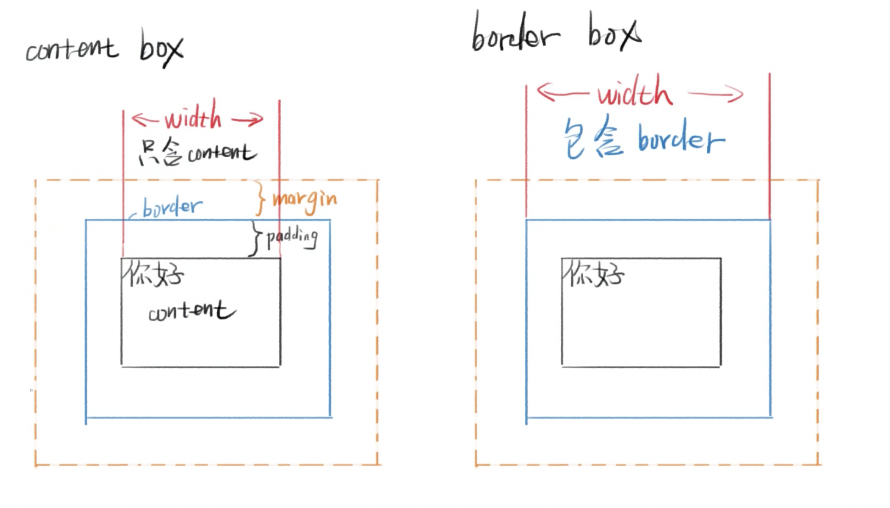
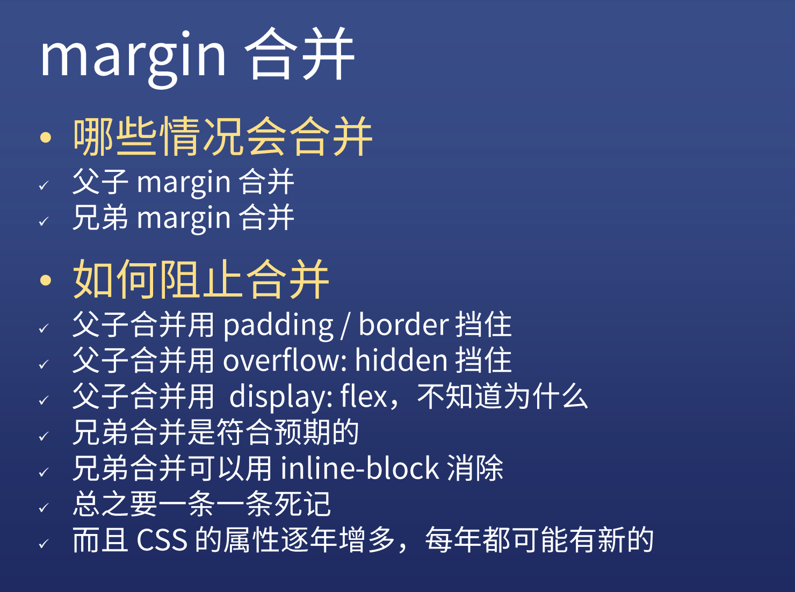
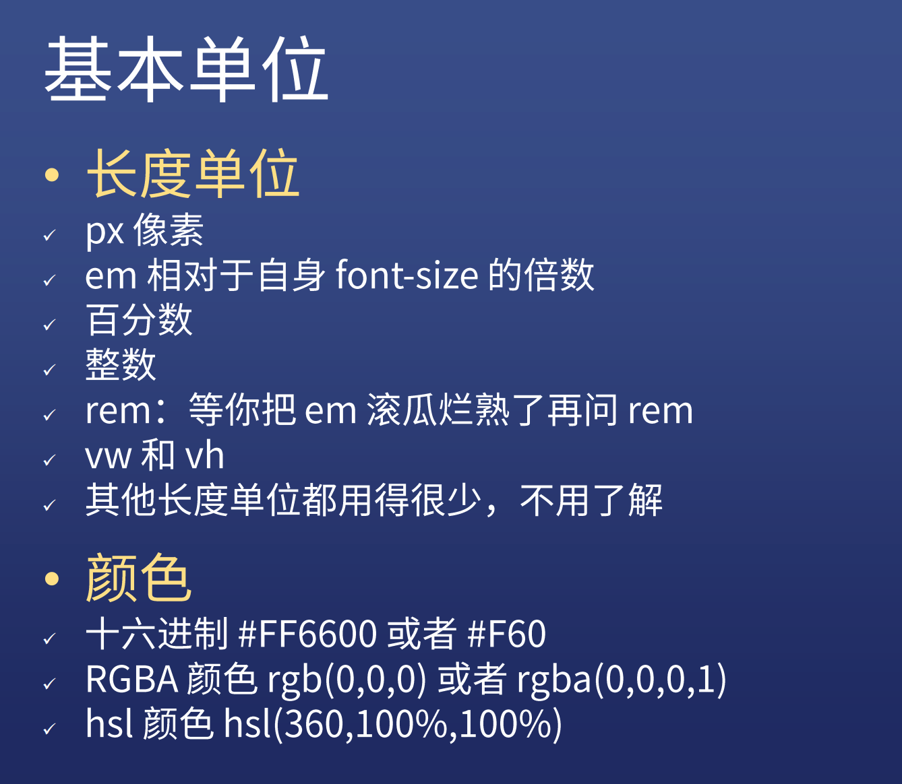

## CSS 历史

### 层叠

* 样式层叠：多次对同一选择器层叠
* 选择器层叠：可以用不同的选择器对同一个元素进行样式声明
* 文件层叠：可以用多个文件进行层叠

### 查看Css样式是否支持浏览器

* 一个浏览器一个浏览器的试
* [caniuse](https://caniuse.com)

## 体系化学习CSS

[CSS 官方文档](https://www.w3.org/Style/CSS/specs)

### 语法

* 语法一：

  选择器 {

  ​	属性名: 属性值 ;

  ​	 /\*注释\*/

  }

  怎样判断是否错误：

  1. 看页面显示变化
  2. 打开检查元素，选中对应目标，查看Styles里面CSS是否有删除线

  CSS 区分大小写

  注释不能用//，只能用 /**/ 

* 语法二：at语法

  1. @charset "UTF-8" 设置字符编码
  2. @import url(2.css); 导入新的css 前两条后面加；
  3. @media(min-width:100px)and(max-width:200px) 媒体查询

  注：charset 是字符集，utf-8是字符编码 

* 如何调试CSS

  1. 看VSCode颜色变化
  2. 看WebStorm颜色变化
  3. 使用开发者工具看是否有警告

### Border 调试法

​		补充步骤

​		CSS里先写一个border：1px solid red； 如果显示边框，则选择器没有问题

​		border这行代码一直往下试，判断是哪行代码出错了   

### CSS 学习资料

* Google搜索关键字mdn
* CSS tricks
* 张鑫旭的博客

### CSS 练习素材

* Freepik搜索PSD web
* 中文免费psd下载
* 365 PSD里的UI套件
* dribbble 顶级设计师社区
* 模仿经常访问的商业网站

### CSS 标准规范

* 谷歌搜索 CSS sepc
* CSS 2.1 中文版 

## 文档流

### 文档流：表示文档流动的方向（从左到右，从上到下）

* inline元素（例如span）
  1. 从左到右显示，如果超出一行的话会在第二行显示，
  2. 高度由line-height间接决定，不能用height设置行高
  3. 宽度为内部inline元素的和，不能用width指定
* block元素（例如div）
  1. block元素从上到下，每一个元素占用一行
  2. block元素默认自动计算宽度，能有多宽，就占多宽，可用width指定宽度，宽度一般不设置100%
  3. block元素高度由内部文档流元素决定，可以设置height
* inline-block
  1. 默认方向也是从左到右
  2. 宽度结合前两者特点，可以用width指定，与inline的区别是超出一行的话不会在第二行显示
  3. 高度同block元素一样，由内部文档流元素决定，可以设置height
* 所有的文档流设置在CSS里设置display:inline/block/inline-block

### overflow 溢出（当内容大于容器时会溢出）

* 在CSS里添加overflow来设置
* visible 默认设置，显示溢出部分（设定长、宽值，用border测试）
* hidden 隐藏超出部分
* scroll 设置滚动条，不溢出也有
* auto 自动设置，如果不溢出的话不添加滚动条，溢出时候添加
* overflow可分为overflow-x和overflow-y

### 脱离文档流

* position:absolute/fixed
* float:left/rightx 

## 盒模型

  设置时在CSS里box- sizing:context-box/sizing-box

* context-box 内容盒模型：内容就是盒子的边界

  宽度=内容宽度

* border-box 边框盒模型：边框才是盒子的边界

  宽度=内容宽度+padding+border

* inline-block会撤销margin合并

* margin合并只影响上下边距，不影响左右边距

* 取消外边距合并的方式，加border-top，或者加padding-top，overflwo:hidden

* 学习成绩
* 科技创新
* 学生工作（学生会）
* 发展党员
* 英语
* 奖学金
* 专业技能
* 表彰
* 活动