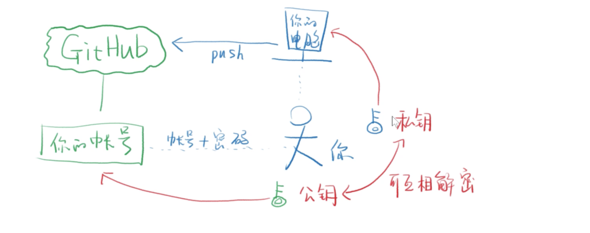

## GitHub 入门

### Git怎么知道提交的是我的代码呢？

SSH Key 身份验证

公钥和私钥生成路径：[/Users/milkboy/.ssh/id_ed25519.pub.](/Users/milkboy/.ssh/id_ed25519.pub.)

[/Users/milkboy/.ssh](/Users/milkboy/.ssh)目录下的id_ed25519为私钥	id_ed25519.pub为公钥

GitHub给我的公钥：`SHA256:nThbg6kXUpJWGl7E1IGOCspRomTxdCARLviKw6E5SY8`

## Git上传代码

### 上传代码到当前分支

* 创建本地git文件

* 新建第一个仓库，复制其ssh地址

  复制页面里的代码

* [git remote add origin git@]()

  origin是仓库名，可以自定义在本地添加远程仓库地址，origin是远程仓库的默认名字，可以换，但是不建议换

* [git branch -M main]()

* [git push -u origin main]()

  推送本地master分支到远程origin的master分支
  
* [git push -u origin main -f]() 强行覆盖仓库原有的内容

### 上传代码到其他分支

* 方法一：

  [git push origin x:x]()

* 方法二：

  [git checkout x]()

  [git push -u origin x]()

### 下载别人的代码

* [git clone git@xxxxxx[目标路径]]()
* 如果是不同机器，需要上传新的ssh key
* cd 目标路径
* [git add/commit/[git pull]/git push]()四连操作

### 如何下载某个分支

* 下载整个仓库，然后用git checkout 分支名

### git clone git@?/xxx.git

* 会在当前目录下创建一个xxx目录
* xxx/.git是本地仓库
* cd xxx下载之后进入xxx文件夹

### git clone git@?/xxx.git yyy

* 会在本地新建yyy目录，将仓库下载到yyy目录，cd yyy

### git clone git@?/xxx.git .

* 不会新建目录，下载到当前目录

**远程仓库只是本地仓库的备份，所有变化都要先commit到本地仓库，然后push到远程仓库**

