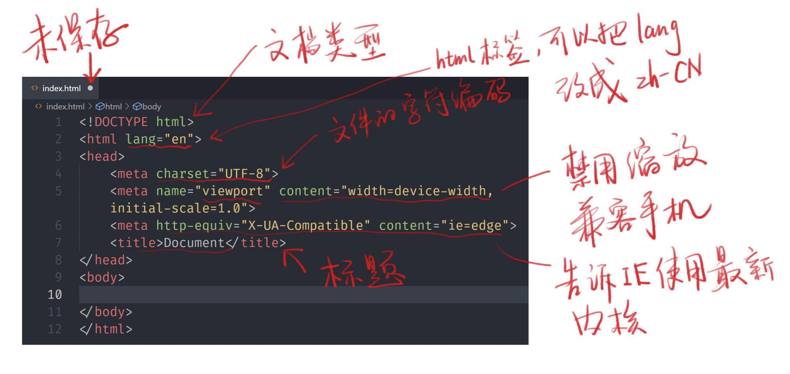

## 语法规范

* div里面能放内容
* 语法规范里没有等于好 text=“checkbox” checked 勾选上 
* 直接闭合语法 <link>
* 属性id若id名中间有空格，需要加引号
* 大小写没有区别
* 查html用法：goole搜索mdn 标签名

## 如何调试

* 看vscode颜色变化
* 看webstorm颜色变化
* 使用HTML验证器 HTML validator

## 英语小课堂

`heading` 标题    `body` 身体、正文    `paragraph` 段落    `section` 章、节    `article` 文章    `main` 主要的    `aside` 旁边的    `anchor` 锚、定点    `strong` 强壮、重要    `emphasis` 强调、重读    `order` 顺序、秩序    `ordered` 有顺序的    `unordered` 无序的    `description` 描述    `term` 术语    `data` 数据    `quote` 引用    `block` 块    `inline` 行内、内联    `break` 打断

## 学习工具

### 标签查找

* MDN html5
* [《网道HTML教程》](https://wangdoc.com/html/index.html) 阮一峰著

### 在线代码编辑工具

* [JSBin](http://js.jirengu.com/)
* [代码沙盒](https://codesandbox.io/)

## HTML 起手式



## 标签

### 章节标签

* **标题 `h1～h6`**
* **章节 `section`**  表示开始一个新的章节
* **文章 `article`**
* **段落 `p`**
* **头部 `header`**
* **脚步 `footer`**
* **主要内容 `main`**
* **旁枝内容 `aside`**
* **划分 `div`**

```html
 <!DOCTYPE html>
<html lang="zh-CN">

<head>
  <meta charset="UTF-8" />
  <meta http-equiv="X-UA-Compatible" content="IE=edge" />
  <meta name="viewport" content="width=device-width, initial-scale=1.0" />
  <title>Document</title>
</head>

<body>
  <header>顶部广告</header>
  <div>≈
    <main>
      <h1>文章标题</h1>
      <section>
        <h2>第一章</h2>
        <p>
          这是一段话这是一段话这是一段话这是一段话这是一段话这是一段话这是一段话这是一段话这是一段话这是一段话这是一段话这是一段话这是一段话这是一段话这是一段话
        </p>
        <section>
          <h3>1.1节</h3>
          <p>一段话</p>
        </section>
        <section>
          <h3>1.2节</h3>
          <p>一段话</p>
        </section>
      </section>
    </main>
    <aside>
      参考资料 1 2 3
    </aside>
    </main>
    <footer>&copy; 版权所有</footer>
</body>

</html>
```


版权标志：&copy；

### 全局属性

* **`class` 添加样式 使用class定义样式编号之后，在<head>标签里用 .样式编号{ }来控制样式**
* **`contenteditable` 可以使任何一个元素被编辑**
* **`hidden` 隐藏一个东西**
* **`id` 类同于class，不到万不得一步要用id，如果有两个id不会报错，用#样式编号{ }来控制样式，js里面可以直接调用id，但一般不这样用，控制台里面window.所有的关键字都不能用**
* **`style`等同于head标签里的style属性，style=" "属性的优先级要高于css里面**
* **`tabindex` 按下键盘tab键，跳转到对应位置，正数顺序访问，0是最后访问，-1表示不访问**
* **`title` 鼠标放上去显示隐藏的内容**

### 怎样让style被看到

1. 将style从<head>标签移动到<body>标签
2. 加style{display：block}来显示

  注：配合contenteditable可以边编辑边修改样式

### 单行文字溢出该怎么写

* `white- space：nowrap；`单行显示
* `text-overflow：ellipsis；`超出部分用...代替
* `overflow：hidden；`超出隐藏

## 默认样式

打开检查元素，选择对应位置，user agent stylesheet显示默认样式，element.style里css可替代默认样式

css reset 去掉默认样式，一般来说写之前要清楚默认样式，两个style一个清除默认样式，一个添加新样式

## 内容标签

* **`ol+li` 有顺序的列表**
* **`ul+li` 无顺序的列表**
* **`dl+dt+dd` dl在外层，dt和dd在内层，dt表示描述对象，dl表示描述内容**
* **`pre` 多个连续的空格、回车、tab都会只表示成一个空格，用pre包起来会显示原始内容**
* **`code` 里面包含的是代码段，显示的英文字母是等宽的**
* **`hr` 分割线**
* **`br` 换行**
* **`a` 超链接**
* **`em` 表示强调**
* **`strong` 加粗**
* **`quote` 引用**
* **`blockquote` 块级引用（换行引用）**

